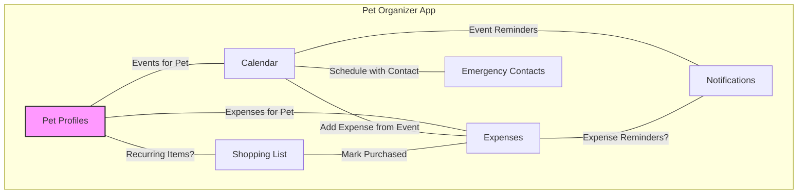

# Pet Organizer Feature Integration Plan

## 1. Goal

To enhance the user experience of the Pet Organizer app by creating tighter integrations between existing features, making workflows smoother and information more contextually relevant.

## 2. Core Strategy: Pet-Centric Hub

The primary approach is to make the **Pet Profile** the central hub of the application. Whenever applicable, other features like Calendar Events, Expenses, and potentially Shopping List items should be linked back to the specific pet(s) they relate to.

## 3. Proposed Integration Points

### 3.1. Pet Profiles <-> Calendar
*   **Link Events to Pets:** When creating/editing calendar events (vet visits, grooming, medication), allow associating the event with one or more specific pets from the user's list.
*   **Pet-Specific View:** On the Pet Profile screen, display a list or section showing upcoming events related *only* to that specific pet.
*   **Automated Reminders:** Add pet birthdays (from profile data) automatically to the calendar with optional reminders.

### 3.2. Pet Profiles <-> Expenses
*   **Link Expenses to Pets:** When adding/editing expenses, allow tagging the expense to a specific pet.
*   **Pet-Specific Costs:** On the Pet Profile screen, display a summary (e.g., total cost this month/year) or a list of expenses associated *only* with that specific pet.

### 3.3. Calendar <-> Expenses
*   **Streamlined Workflow:** After viewing a completed or upcoming calendar event (e.g., Vet Appointment), provide a quick action button like "Add Expense for this Event?".
*   **Pre-filled Data:** This action should navigate to the "Add Expense" screen, pre-filling details like the date and potentially the item/service description based on the event title.

### 3.4. Shopping List <-> Expenses
*   **Streamlined Workflow:** On the Shopping List screen, add a button next to items like "Mark Purchased & Add Expense".
*   **Pre-filled Data:** This action should remove the item from the shopping list and navigate to the "Add Expense" screen, pre-filling the item name and potentially a default category (e.g., "Supplies").

### 3.5. Shopping List <-> Pet Profiles (Potential Enhancement)
*   **Recurring Needs:** For items purchased regularly for specific pets (e.g., prescription food, specific treats), consider allowing users to link a shopping list item to a pet profile.
*   **Future Possibilities:** This could enable features like pet-specific shopping suggestions or low-supply reminders based on purchase frequency.

### 3.6. Emergency Contacts <-> Calendar
*   **Quick Scheduling:** When viewing an Emergency Contact (e.g., Vet Clinic, Groomer), add a button like "Schedule Appointment".
*   **Pre-filled Data:** This action should navigate to the "Add Event" screen, potentially pre-filling the contact's name or location in the event details.

### 3.7. Enhanced Notifications
*   Leverage the above connections to provide more targeted and useful notifications:
    *   Reminders for pet-specific upcoming events.
    *   Reminders for recurring expenses linked to pets (if implemented).
    *   Potential low-supply warnings based on shopping list purchase history (advanced).

## 4. Visual Diagram

## 5. Next Steps

Implement the integration points, potentially prioritizing the links between Pet Profiles, Calendar, and Expenses as they offer significant immediate value.